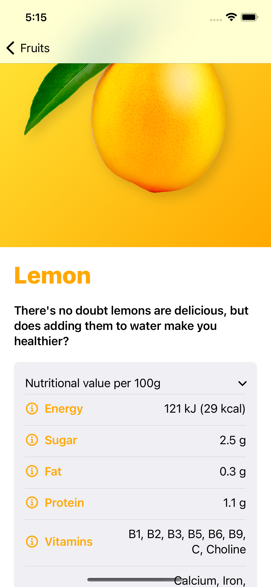
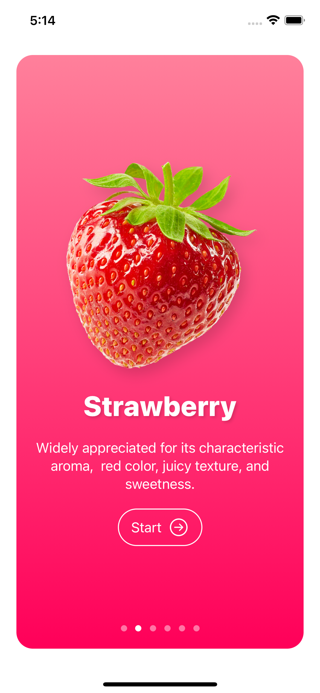
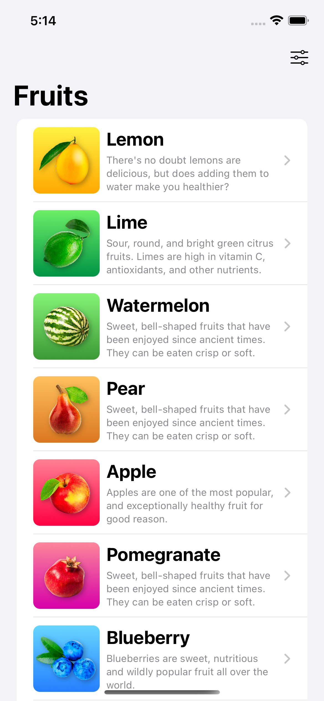
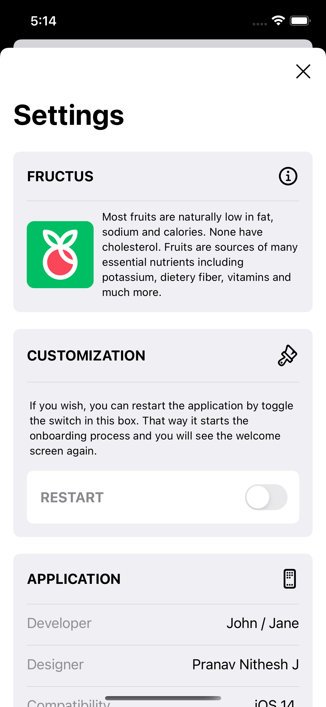
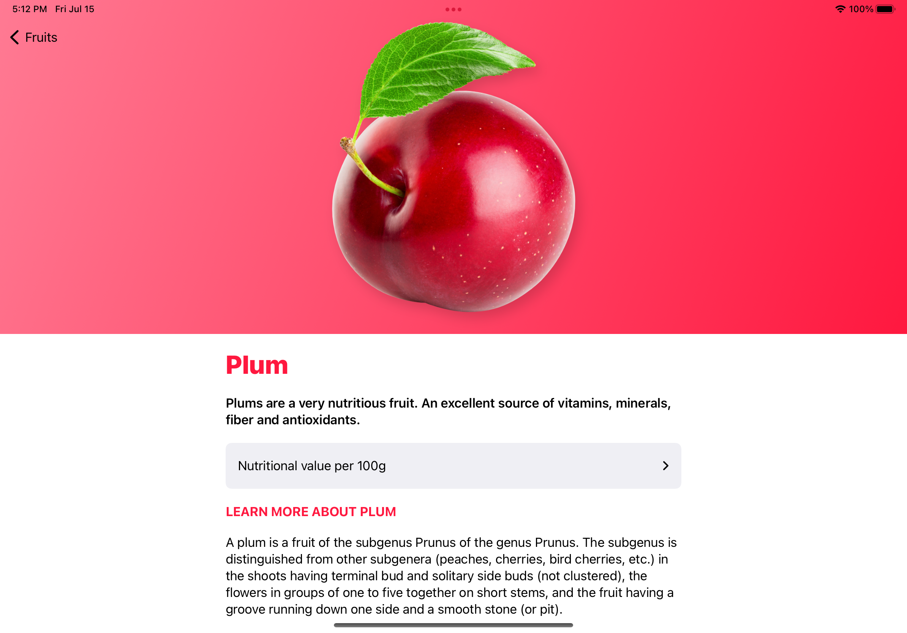
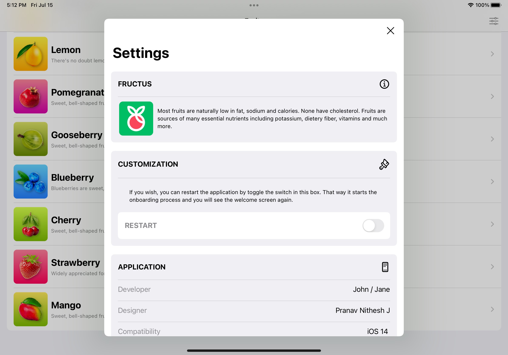

# Fructus_SwiftUI

---

<h2> 
  Full featured Fruits Catalog like app written in SwiftUI.
</h2>

  
  
  
  

  
  
  

---

<h2>
  Features
</h2>

- Cards of different fruits.
- Fruits Lists to select.
- Fruits detail page.
- Settings Page.

---

<h2>
  Notes
</h2>

 Use of hardcoded data stored locally to get fruits details.

---
